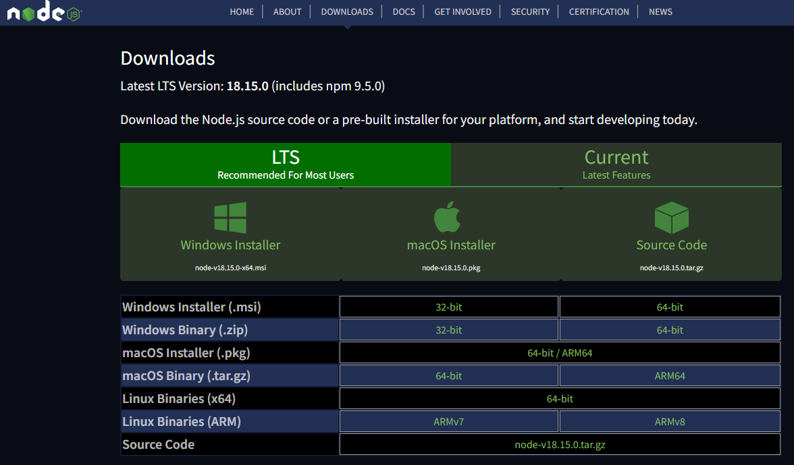
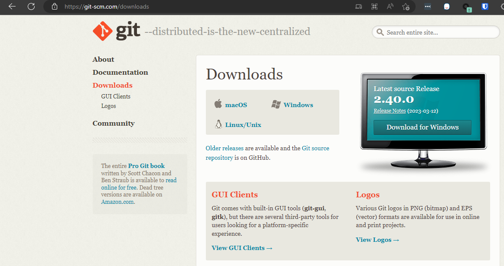
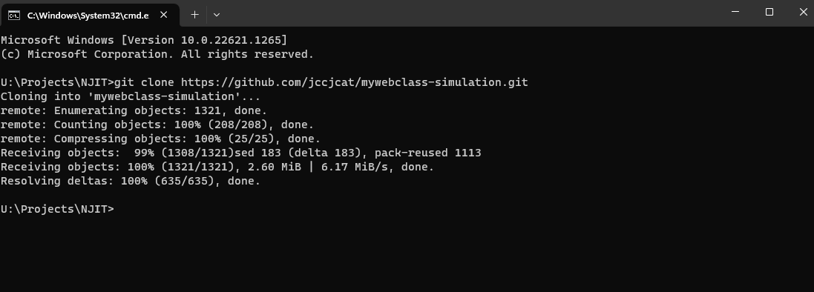
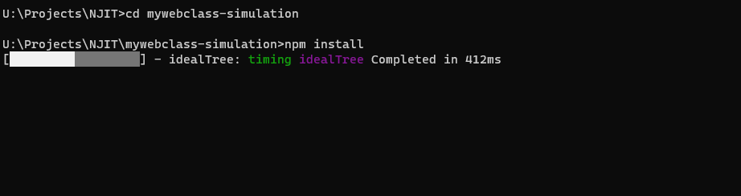

# Installation Instructions - For Local Development
## Developer Machine Instructions
### Dependencies:
- Node.JS
- Git
- Code Editor or IDE (Visual Studio Code, PyCharm, Web Storm, etc.)

1. Install Node JS for your machine. The installation files can be found at https://nodejs.org/en/download

2. Install Git for your machine. The installation files can be found at https://git-scm.com/downloads

3. Clone the repository from GitHub using Git and a terminal (For exmaple: Terminal for macOS, Command Prompt or Powershell for Windows). The clone links can be found on under the Code button on the repository on GitHub: https://github.com/jccjcat/mywebclass-simulation

4. Install dependencies using the command "npm install" on the terminal.

5. Start the application locally using the command "npm start" on the terminal. 

